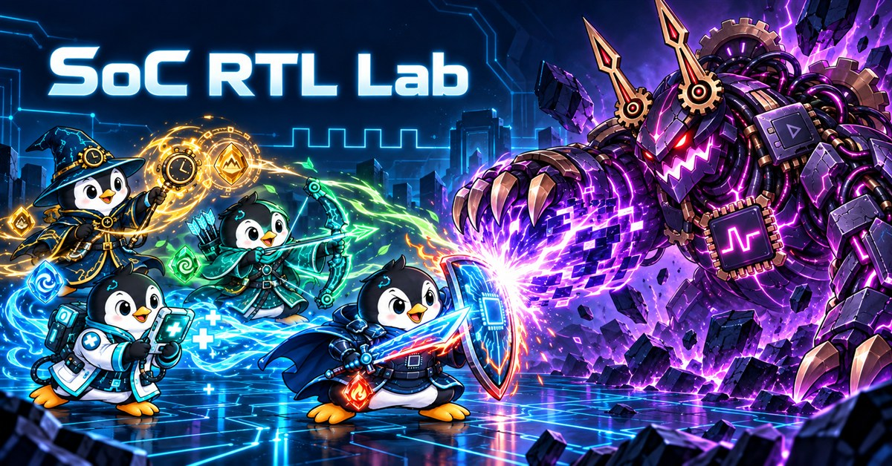
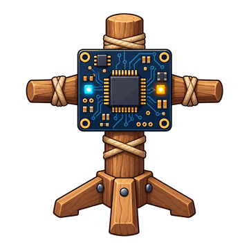
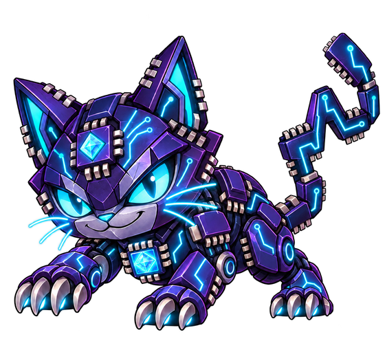
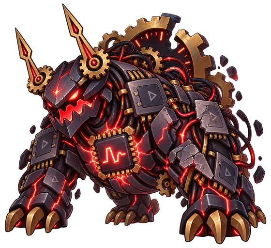
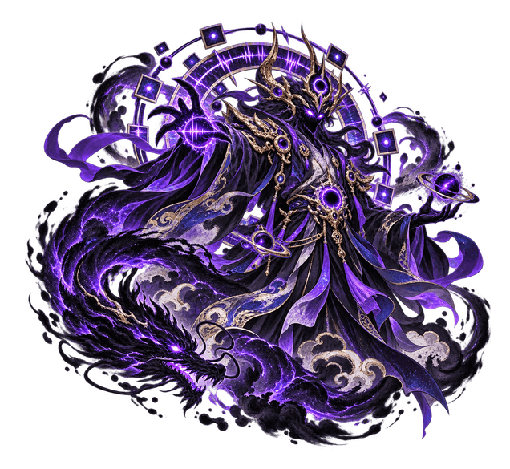

# SoC RTL Lab

<p align="center">
  
</p>

An original, bilingual (Traditional Chinese / English) hands-on practice site for SoC and digital IC engineering.

The current release contains 48 coding, debugging, constraint, and interactive challenges. CPU/cache is now an independent track, separate from SoC and accelerator integration. The SoC path progresses from software-visible control and ready/valid flow through AXI/DMA, SRAM/CDC, command queues, mixed-precision arithmetic, and a streaming compute-tile capstone. The CDC track includes a complete asynchronous FIFO.

Timing-sensitive exercises include bilingual golden behavior patterns that can be permanently unlocked per exercise with a Debug Visor. Every challenge now has a compact Timing Crystal card that first explains the idea with a familiar analogy, then says what to build and how to tell whether it works; the Ready/Valid exercise additionally uses an EMPTY/FULL seat model. Each progressive hint uses one Chip Companion. New profiles receive 20 Debug Visors, 20 Timing Crystals, and 50 Chip Companions; schema migration adjusts the original starter grant without resetting solved work. A local-date daily loop adds a 50-coin check-in, a rotating RTL review worth 80 coins, and a seventh-day bonus without background timers or network tracking. After simulation, the browser runs the learner RTL and the reference RTL against the same stimulus, then aligns every DUT output as adjacent **Your / Golden** waveform rows. Shared inputs appear once, output badges identify matches or mismatches, and VCD aliases are preserved so a testbench wire cannot hide the corresponding DUT port. Golden waveforms are cached per exercise and rendering is capped to keep repeat runs responsive.

An optional game layer places an original penguin companion beside progressive hints and test feedback. Solving domain exercises unlocks four electronic-fantasy professions; points, equipment, elemental enchantments, training targets, and the advanced timing boss provide visible progression without changing the simulator or judging rules. All companion variants now use one consistent character scale and rendering family. Opponents use a separate mechanical-target family so allies and enemies remain visually distinct.

PayPal.Me is the current public voluntary-support option and does not grant points. Visitors who need another support method can contact the author through the portfolio site. Automatic paid points and gifting remain disabled until a server can verify payments, store entitlements and transaction records, and support refunds.

See [MONETIZATION.md](MONETIZATION.md) for the paid-point architecture, suggested packs, privacy boundaries, and launch checklist.

## Penguin companion and profession guide

The four columns below are the definitive profession artwork used by the site. Each cell shows the masculine and feminine option at the same scale. Gender is cosmetic and never changes points, unlock conditions, equipment rules, hints, or judging.

<table>
  <thead>
    <tr>
      <th align="center">CPU swordsman</th>
      <th align="center">SoC archer</th>
      <th align="center">DFT healer</th>
      <th align="center">Timing mage</th>
    </tr>
  </thead>
  <tbody>
    <tr>
      <td align="center"></td>
      <td align="center"></td>
      <td align="center"></td>
      <td align="center"></td>
    </tr>
  </tbody>
</table>

| Profession                                  | Unlock route                           | Battle skill                                            | How to train with it                                                                                                    |
| ------------------------------------------- | -------------------------------------- | ------------------------------------------------------- | ----------------------------------------------------------------------------------------------------------------------- |
| Circuit Swordsman / CPU Specialist          | Solve 3 CPU/cache challenges           | Sword swing and layered sword waves                     | Trace dependencies first; explain forwarding priority, stalls, flushes, tags and replacement state cycle by cycle.      |
| Circuit Archer / SoC Integration Specialist | Solve 3 SoC challenges                 | Staggered arrow rain                                    | Follow one transaction across ready/valid, address mapping, AXI, DMA, SRAM latency and CDC boundaries.                  |
| Silicon Healer / DFT Specialist             | Solve 2 DFT challenges                 | Holy-light orb and diagnostic pulses                    | State the fault model, then connect controllability, observability, scan/MBIST sequencing and failure evidence.         |
| Timing Mage / Timing & Low-Power Specialist | Solve 3 timing or low-power challenges | Elemental burst whose color follows the strongest stone | Identify launch/capture clocks and path type before choosing a setup, hold, isolation, retention or power-sequence fix. |

### Progression, equipment, and enchantments

- Profession unlocks depend on completed exercises in the matching domain. Changing gender or profession never resets progress.
- Total earned points determine the visual tier: base below 300 points, tier 1 at 300, tier 2 at 700, and tier 3 at 1,300. Purchases use a separate spendable balance and therefore do not lower rank or remove an unlock.
- Any affordable shop item can be purchased immediately. Common equipment can be worn by every profession; profession equipment stays in inventory and becomes wearable when its matching class is active.
- Wearable equipment can be sold back from the shop for half of its current listed price. Selling an equipped item automatically unequips it.
- Learning tools cost 60–140 points, Forge Hammers cost 220 points, equipment costs 350–500 points, and elemental enchantments cost 260–500 points. A Debug Visor unlocks one exercise's Golden pattern, a Timing Crystal unlocks that exercise's compact reasoning card, and a Chip Companion unlocks the next hint. Each unlock is saved locally and never consumes the same item twice.
- Owned equipment can be dragged onto the forge or upgraded from its button. Each attempt consumes one Forge Hammer. Gear runs from 0 to 5 stars with success rates of 100%, 80%, 65%, 45%, and 30%. A failed attempt at 0–1 stars is protected; at 2 stars or above it drops one star. Five-star Divine Gear adds a stronger visible aura and attack effect, but star level never changes scores, judging, hints, drops, or challenge difficulty. Selling gear resets its stars and refunds half of the current base price.
- Daily check-in grants 50 coins. Every seventh consecutive day adds 150 coins and one Forge Hammer. A deterministic daily RTL review rotates through the full challenge library and grants 80 coins when passed, including when revisiting an already-solved exercise. Review mode opens a temporary starter-code draft, never overwrites the saved answer, and hides previously unlocked hints, Golden behavior, and reasoning cards for solved exercises. All daily state stays in this browser.
- The first clear of an advanced or final BOSS has a 62% chance to drop 2–5 learning tools, a 15% chance to drop one unowned piece of equipment, and a 23% no-drop result. If all equipment is already owned, the equipment roll becomes a consumable drop.
- The companion dialog separates the **Backpack** from the **Shop**. The backpack selects gender, an unlocked profession, owned equipment, and one active element; the shop only handles purchases and upgrades.
- Equipment and enchantments change only the companion and battle presentation. They never alter compilation, hidden checks, hints, PPA comparison, or the pass/fail verdict.

<p align="center">
  
</p>

| Stone | Visible treatment                                   | Engineering learning cue                                          |
| ----- | --------------------------------------------------- | ----------------------------------------------------------------- |
| Fire  | Red-orange outfit trim, particles, and attack color | Focus on the first mismatch and isolate the root cause.           |
| Water | Blue flowing trim and waveform-like particles       | Follow valid/data alignment and signal movement cycle by cycle.   |
| Wind  | Mint-green motion accents and faster-looking trails | Narrow the failing regression and reduce the debug search space.  |
| Earth | Amber-gold stable aura and heavier impact           | Build reproducible boundary tests, assertions, and stable checks. |

Repeated purchases increase that stone's visual intensity. Owned stones can be switched freely in the backpack; owning at least one of all four unlocks the selectable **Four Roots** orbit, spectrum outfit aura, and prismatic battle beam. This is a visual reward, not an electrical model or gameplay advantage.

### Battle targets and verdict animation

<table>
  <thead><tr><th>RTL Training Dummy</th><th>Dark Venom Spirit Cat</th><th>Dark Thunder Guardian Bear</th><th>Timing Boss</th><th>Dark Immortal Sovereign</th></tr></thead>
  <tbody>
    <tr>
      <td align="center"></td>
      <td align="center"></td>
      <td align="center"></td>
      <td align="center"></td>
      <td align="center"></td>
    </tr>
    <tr><td>Exercises 1–10 · Fundamentals</td><td>Later beginner exercises · Dark / Poison</td><td>Intermediate · Dark / Lightning</td><td>Advanced · Timing / Array</td><td>Hardest five challenges · Dark / Ink</td></tr>
  </tbody>
</table>

Pressing **Run tests** moves the active companion into the hint-area arena and triggers the profession-specific attack: sword wave, arrow rain, holy-light pulse, or elemental burst. Exercises 1–10 always use the training dummy. Only the five highest-level challenges use the three-times-larger Dark Immortal; on failure it counters with a dark timing-array seal and energy beam. A first-time pass produces an arena-wide flash, PASS seal, confetti burst, enemy defeat, and a one-time coin-gain prompt. Re-running a solved exercise never awards or displays the same reward again. A failing result produces a red impact flash, damage ring, visible hit marker and companion recoil before directing the learner to the first diagnostic. The companion then returns to its normal position. These short, CSS-only verdict effects never cover the editor, waveform or debug output.

Simulation verdicts use two gates: the self-checking testbench must pass, and every externally visible DUT output waveform must match the Golden run over the same stimulus. This prevents checkpoint-only false passes such as an arbiter that briefly drives an incorrect grant between sampled checks. The first mismatch is reported with signal name, simulation time, Golden value, and current value.

The companion, enchantment, training-target, and boss visuals are project-specific artwork and contain no vendor logos, commercial game characters, foundry material, or proprietary IP.

## CPU and cache practice

The nine CPU/cache exercises are original Verilog-2005 labs with bilingual specifications, three progressive hints, self-checking simulation, and browser-rendered waveforms:

| Area         | Exercise                    | Main design or debug target                              |
| ------------ | --------------------------- | -------------------------------------------------------- |
| CPU datapath | 32×32-bit register file     | Two asynchronous reads, synchronous write, hard-wired x0 |
| Pipeline     | Forwarding unit             | EX/MEM priority over MEM/WB and x0 exclusion             |
| Pipeline     | Load-use and branch control | Stall versus bubble, branch-flush priority               |
| Prediction   | Two-bit predictor           | Saturation, hysteresis, prediction/update timing         |
| Cache        | Direct mapped               | Tag/index/offset and conflict eviction                   |
| Cache        | Two-way set associative     | Parallel tag compares and way selection                  |
| Cache        | Fully associative           | CAM-style all-entry lookup and priority                  |
| Cache        | Two-way LRU                 | Invalid-way priority and per-set replacement state       |
| Cache        | Blocking miss controller    | Hit, clean refill, dirty write-back, and back-pressure   |

These deliberately small models expose the architecture trade-offs: direct mapping uses one candidate and a short lookup path; set associativity adds comparators, a data mux, and replacement state to reduce conflict misses; fully associative lookup searches every entry and therefore fits only small structures. They are teaching components, not a complete ISA-compatible CPU, coherent cache, or production memory hierarchy.

## SoC and accelerator integration practice

The separate SoC track is organized around the boundaries a Linux-controlled FPGA accelerator must implement:

Every SoC exercise now opens with a bilingual system-position diagram and a complete port contract before the editor. The diagram identifies the upstream source, the block being implemented, the downstream consumer, and the transaction path. The port table states direction, width, sampling/handshake timing, and functional purpose for every top-level signal. Three progressive hints then move from the transaction model, through the required state or equations, to an implementation skeleton without exposing a paste-ready solution.

| Stage                   | Exercises                                                                                             | Demonstrated capability                                                            |
| ----------------------- | ----------------------------------------------------------------------------------------------------- | ---------------------------------------------------------------------------------- |
| Software control plane  | APB register, AXI4-Lite register bank, W1C interrupt status                                           | Explain register maps, start/status, sticky events and software-visible completion |
| Data movement           | Ready/valid register slice, AXI burst reader, strided DMA address generator, async FIFO, SRAM wrapper | Preserve payloads under back-pressure and align memory/CDC latency                 |
| Compute                 | Signed INT8/INT4 dot product, streaming mixed-precision tile                                          | Define packing, sign extension, accumulator width, job boundaries and throughput   |
| Scheduling and evidence | Round-robin arbiter, command FIFO, bit-true requantization and relative Yosys comparison              | Queue multiple jobs and support design claims with automated evidence              |

Every track also includes a three-part speaking checklist. A solved badge is therefore only the first step: the learner should be able to state the cycle-level contract, identify a corner case and its verification evidence, and explain the relevant PPA or architecture trade-off without reading the solution.

## DFT and low-power practice

These seven original Verilog-2005 exercises each include a bilingual specification, three hints, role/rationale notes, self-checking simulation and VCD signals. They build on memory reliability, accelerator activity and SoC integration concepts:

| Track     | Exercise                      | Main debug target                                                      |
| --------- | ----------------------------- | ---------------------------------------------------------------------- |
| DFT       | Scan shift/capture            | Serial direction, capture/shift priority, reset                        |
| DFT       | SRAM MBIST                    | Four ascending phases: w0, r0, w1, r1; read latency and sticky failure |
| DFT       | Spare-row remapping           | Consistent read/write redirection and exclusive bank enables           |
| Low power | Clock gate with test override | Low-level latch, full clock pulses, scan accessibility                 |
| Low power | Operand isolation             | Hold multiplier operands during invalid cycles                         |
| Low power | Retention register            | Keep saved state powered and define save/restore/write priority        |
| Low power | Power sequencer and isolation | Drain work, save, isolate, power off, wait for power-good, restore     |

The MBIST fixture injects one stuck-at bit (bit 2) at each of eight addresses, in both polarities. This is a destructive teaching test, **not** full March C-, ATPG/fault coverage, physical BISR, flash programming, or a yield measurement. The remapper assumes stable repair configuration and a combinational interface; a real synchronous SRAM needs bank-selection latency alignment.

The clock-gate exercise intentionally models a latch, not an accidental inferred latch. Real ASICs must use qualified ICG cells and check gating setup/hold, CTS/STA and DFT. FPGA clock-enable primitives are preferred over fabric-gated clocks. Retention and isolation are behavioral models only; they do not instantiate UPF supplies, retention cells or physical power switches. No power savings or signoff result is inferred from simulation or cell counts.

Public conceptual references (not copied exercise/test content): [OpenROAD DFT](https://openroad.readthedocs.io/en/latest/main/src/dft/README.html), [Yosys clockgate](https://yosyshq.readthedocs.io/projects/yosys/en/0.46/cmd/clockgate.html), and [Accellera UPF tutorial](https://www.eda.org/resources/videos/upf-tutorial-2013). No proprietary transcript, vendor IP or foundry model is included.

## Judging model

- Verilog-2005 tasks compile and simulate locally in the browser using fixed-version, SHA-256 checked Icarus Verilog assets downloaded from the [VeriSim upstream distributor](https://github.com/senolgulgonul/verisim). Tool binaries are not redistributed in this repository or Pages artifact.
- Compilation/simulation runs in a disposable Web Worker with a 45-second total limit (including first download) and a simulation-time watchdog. Changing tasks or editing code cancels in-flight jobs.
- No local compiler or EDA installation is required. Yosys WebAssembly is downloaded only when the user requests a generic-cell comparison and can then be browser-cached.
- Simulation results include a browser-rendered VCD waveform. Testbenches that expose `expected_*` signals overlay the golden behavior with the DUT waveform.
- The editor and read-only SRAM model use line numbers, Verilog/CNF syntax coloring, a code-oriented font stack, comfortable line spacing, and multiline module port formatting. The solution remains a plain textarea for accessibility and native editing behavior.
- Vendor-specific APR command exercises are intentionally excluded. Timing topics such as hold repair use interactive, tool-neutral decision labs, with a clearly labeled OpenROAD / ICC2 / Innovus command quick reference for real-flow context.
- Verification exercises now cover a formal-equivalence miter, editable DIMACS CNF with an in-browser DPLL SAT solver, UVM scoreboard plumbing, and bit-true fixed-point checking.
- The UVM exercise is a structural code-review lab, not a substitute for compiling the full UVM library in VCS, Xcelium, or Questa.
- A simulation pass is not CDC signoff, static timing closure, or a proof of physical PPA. The miter exercise enumerates all 16 combinational input patterns; it does not run an industrial formal engine.
- Each challenge has three progressively revealed hints, inspired by coding-practice sites but implemented with original content and local-only progress.
- Progress, earned points, equipment, element levels, and exact historical spend use stable, versioned `localStorage` keys. New releases migrate additively and do not clear existing solutions or completion records. The application has no code-submission backend. GitHub Pages shares browser storage across projects on the same origin. Do not enter confidential RTL or personal data. GitHub/jsDelivr may receive request metadata when serving the site/tools.

Because GitHub Pages is static, bundled tests are inspectable. A trustworthy global leaderboard or truly hidden tests would require a separate sandboxed backend.

## SRAM timing model

The SRAM integration challenge uses an original educational macro with a fictional foundry-style timing contract. It teaches active-low chip/write/byte enables, registered read behavior, and clock-to-Q interpretation without copying a TSMC memory compiler model, Liberty file, datasheet, or NDA material.

The provided model is viewable in the exercise. It models a 0.35 ns clock-to-Q delay but does **not** enforce setup/hold timing checks. No technology-mapped macro area is available.

The AXI labs use reduced, single-outstanding interfaces driven by testbench bus agents, not a bundled ARM core. The CPU/cache labs are compact independent blocks rather than a complete pipeline or coherent hierarchy. Full protocol integration (response channels/attributes, strobes, IDs, errors, coherency and address-boundary rules) is outside this release.

## Area estimation

The site can run Yosys in the browser on demand and report generic cell types and counts for a quick, technology-independent comparison. PPA-focused tasks also synthesize a reference solution in the same browser session and show the user's relative delta under identical Yosys settings. This is not physical area in µm². Technology-mapped area, slack, routing congestion and DRC require Liberty, LEF/PDK, RC corners, SDC and a physical implementation flow. Those inputs are process- and organization-specific, so a zero-install public static site should teach the concepts instead of pretending to provide signoff results.

## Local development

```bash
pnpm install
pnpm dev
```

Build the GitHub Pages bundle with `pnpm build:github`.

Run `pnpm test` for the regression suite (the same Icarus WASM worker runs through a Node message-port shim). GitHub Pages deployment runs this suite before building. See [TESTING.md](TESTING.md) for coverage and manual acceptance checks.

## Independence and licensing

Original application source is GPL-2.0-or-later. The combined browser distribution selects **GPL-3.0-or-later** for compatibility with Apache-2.0 dependencies; individual third-party licenses remain intact. The complete GPLv3 text is included in `public/LICENSE-GPL-3.0.txt`. Do not describe the combined browser bundle as GPLv2-only.

The challenge descriptions, starter code and tests are independently written educational examples. No commercial PDK, licensed SRAM macro, proprietary standard text, internal company records or paper figures are included.

The application is GPL-2.0-or-later, without warranty. Third-party code retains its own licenses. See `public/THIRD_PARTY_NOTICES.txt`; the Pages build generates `OPEN_SOURCE_LICENSES.txt` for dependencies actually bundled in the browser. Upstream WASM-specific build sources have not been independently verified; Icarus binaries are therefore downloaded directly from the upstream distributor rather than republished here. This review is not a legal opinion or a guarantee of third-party compliance.
